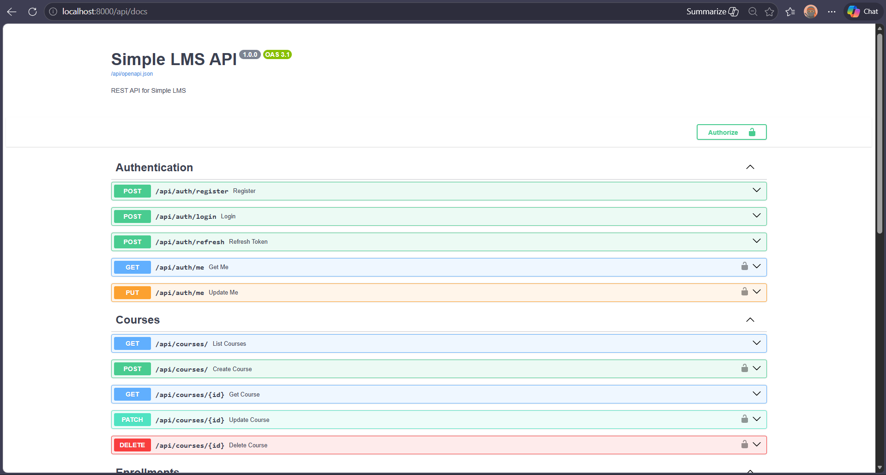

**Nama:** Sultan Sahrul Abdullah  
**Mata Kuliah:** Pemrograman Sisi Server

# Simple LMS - Progress 1: Docker & Django Foundation

Proyek ini adalah implementasi tahap awal (Progress 1) untuk membangun Simple LMS. Fokus utama pada tahapan ini adalah melakukan setup *environment development* menggunakan Docker, konfigurasi Django, dan menghubungkannya dengan database PostgreSQL.

---

## 🚀 Cara Menjalankan Project

1. Pastikan Docker Desktop sudah menyala.
2. Clone repository ini dan buka terminal di dalam direktori project.
3. Buat file `.env` di direktori utama, lalu copy isi dari `.env.example` ke dalamnya.
4. Jalankan perintah ini untuk melakukan build dan menjalankan container:
   ```bash
   docker compose up -d --build
   ```
5. Lakukan migrasi database untuk membuat tabel bawaan Django di PostgreSQL:
   ```bash
   docker compose exec web python manage.py migrate
   ```
6. Buka browser dan akses aplikasi di: **http://localhost:8000**

---

## ⚙️ Environment Variables Explanation

Konfigurasi koneksi dan pengaturan rahasia disimpan dalam file `.env`. Berikut adalah detail fungsinya:

* `POSTGRES_DB`: Nama database PostgreSQL yang dibuat (contoh: lms_db).
* `POSTGRES_USER`: Username untuk autentikasi ke database.
* `POSTGRES_PASSWORD`: Password untuk user database.
* `DB_HOST`: Host dari database. Diisi `db` (sesuai nama service di docker-compose) agar Django bisa terhubung via internal network Docker.
* `DB_PORT`: Port PostgreSQL (5432).
* `SECRET_KEY`: Kunci enkripsi utama yang digunakan oleh Django untuk keamanan session dan *cryptographic signing*.
* `DEBUG`: Diset `True` untuk menampilkan detail log/error selama proses development.

---

## 📸 Dokumentasi

### Screenshot Django Welcome Page


# Simple LMS - Progress 2: Database Design & ORM Implementation

Progress 2 ini berfokus pada perancangan skema database menggunakan Django ORM, implementasi relasi antar model, konfigurasi Django Admin, dan penerapan teknik optimasi query untuk efisiensi sistem.

---

## 🏗️ Data Models & Relations

Berikut adalah struktur model yang telah diimplementasikan dalam aplikasi:
- **Custom User Model:** Menggunakan `AbstractUser` dengan tambahan field `role` (Admin, Instructor, Student).
- **Category:** Mendukung struktur hierarki menggunakan *self-referencing ForeignKey*.
- **Course & Lesson:** Implementasi relasi *One-to-Many* dengan fitur pengurutan materi (*ordering*).
- **Enrollment:** Relasi *Many-to-Many* antara Student dan Course dengan *Unique Constraint* untuk mencegah duplikasi data.
- **Progress:** Fitur untuk melacak status penyelesaian setiap *lesson* oleh siswa.

---

## ⚡ Query Optimization

Optimasi dilakukan untuk mengatasi masalah **N+1 Query** menggunakan `Custom QuerySet`:
1. **`Course.objects.for_listing()`**: Menggunakan `select_related('category', 'instructor')` untuk mengambil data relasi dalam satu query JOIN SQL tunggal.
2. **`Enrollment.objects.for_student_dashboard()`**: Menggunakan `prefetch_related` untuk optimasi pengambilan data relasi yang lebih kompleks.

### Bukti Perbandingan Query:
Anda dapat memverifikasi efisiensi ini dengan menjalankan script demo yang telah disediakan:
```bash
docker compose exec web python demo_queries.py
```
*Hasil: Non-Optimized (6+ queries) vs Optimized (1 query).*

---

## 🛠️ Konfigurasi Django Admin

Interface admin telah disesuaikan agar informatif dan fungsional:
- **Informative List Display:** Menampilkan kolom role, kategori, dan instruktur secara mendetail.
- **Advanced Filtering:** Tersedia filter berdasarkan role user dan kategori course.
- **Inline Lessons:** Pengelolaan materi (Lesson) dapat dilakukan langsung di dalam halaman pengeditan Course.

Akses Panel Admin: **[http://localhost:8000/admin](http://localhost:8000/admin)**

---

## 📸 Dokumentasi

### 1. Dashboard Admin (Struktur Model)


### 2. Bukti Optimasi Query (N+1 Solution)


## 🚀 Progress 3: REST API & Authentication System

Repositori ini berisi implementasi Progress 3 untuk membangun REST API lengkap menggunakan Django Ninja, dilengkapi dengan JWT authentication, Role-Based Access Control (RBAC), dan validasi schema menggunakan Pydantic.

---

## 🎯 Learning Objectives Terpenuhi
- [x] Membuat REST API dengan Django Ninja
- [x] Schema validation menggunakan Pydantic
- [x] JWT Authentication implementation
- [x] Role-Based Access Control (RBAC)
- [x] API documentation dengan Swagger

---

## 📦 Deliverables & Fitur

### 1. API Endpoints Terdaftar
Berikut adalah daftar endpoint yang telah diimplementasikan beserta validasi *role* dan *ownership*-nya:

**Authentication:**
- `POST /api/auth/register` - Register new user
- `POST /api/auth/login` - Login (return JWT tokens)
- `POST /api/auth/refresh` - Refresh access token
- `GET /api/auth/me` - Get current user
- `PUT /api/auth/me` - Update profile

**Courses (Public):**
- `GET /api/courses` - List courses (with pagination & filters)
- `GET /api/courses/{id}` - Course detail

**Courses (Protected):**
- `POST /api/courses` - Create course (Role: `@is_instructor`)
- `PATCH /api/courses/{id}` - Update course (Validation: *Owner Only*)
- `DELETE /api/courses/{id}` - Delete course (Role: `@is_admin`)

**Enrollments:**
- `POST /api/enrollments` - Enroll to course (Role: `@is_student`)
- `GET /api/enrollments/my-courses` - My enrolled courses
- `POST /api/enrollments/{id}/progress` - Mark lesson complete

### 2. Authentication System
- Implementasi JWT token generation (Access & Refresh tokens).
- Token validation menggunakan Global Middleware (`HttpBearer`).
- Keamanan password menggunakan algoritma hashing bawaan Django (PBKDF2/Bcrypt).

### 3. Permission System (RBAC)
- Validasi role dilakukan di level endpoint untuk membedakan akses instruktur, admin, dan siswa.
- Validasi *ownership* diterapkan pada endpoint Update Course, memastikan hanya instruktur pembuat kursus yang dapat mengedit datanya.

### 4. Schema Validation
- Semua request dan response API telah divalidasi secara ketat menggunakan **Pydantic Schemas** (`ModelSchema` dan `Schema`).

---

## 📸 API Documentation & Testing

### Swagger UI
Dokumentasi interaktif Swagger otomatis ter-generate dan dapat diakses di: **`/api/docs`**



### Postman Collection
Untuk pengujian API secara menyeluruh (Register, Login, CRUD), *Postman Collection* telah disediakan dalam repository ini. Silakan *import* file berikut ke aplikasi Postman:
👉 **`simple_lms_postman.json`**

---

## 🚀 Cara Menjalankan Project (Local/Docker)

1. **Jalankan Container:**
   ```bash
   docker compose up -d
   ```
2. **Jalankan Migrasi Database:**
   ```bash
   docker compose exec web python manage.py migrate
   ```
3. **Akses Swagger UI:**
   Buka browser dan navigasikan ke `http://localhost:8000/api/docs` untuk mulai menguji API.