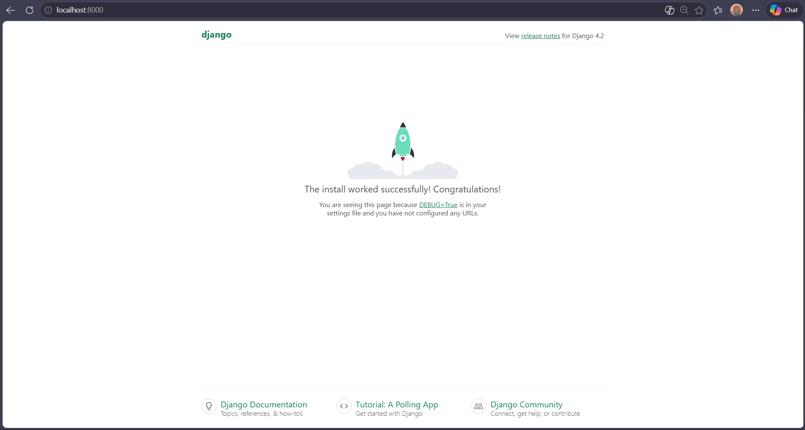
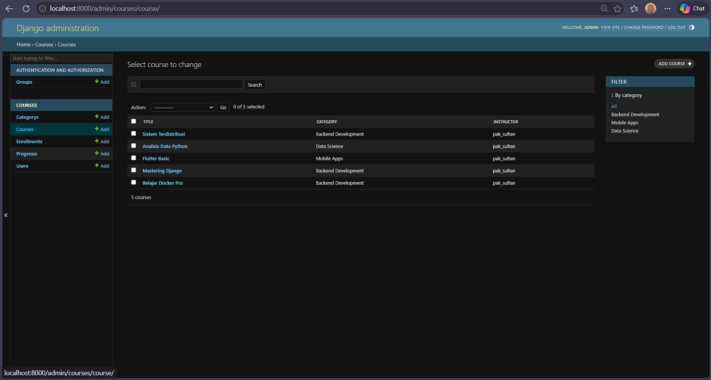
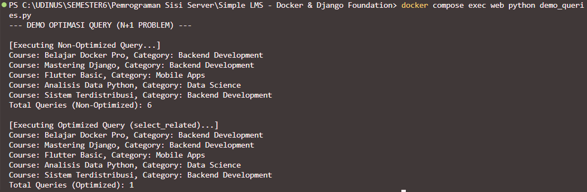

# Simple LMS - Progress 1: Docker & Django Foundation

**Nama:** Sultan Sahrul Abdullah  
**Mata Kuliah:** Pemrograman Sisi Server

Proyek ini adalah implementasi tahap awal (Progress 1) untuk membangun Simple LMS. Fokus utama pada tahapan ini adalah melakukan setup *environment development* menggunakan Docker, konfigurasi Django, dan menghubungkannya dengan database PostgreSQL.

---

## 🚀 Cara Menjalankan Project

1. Pastikan Docker Desktop sudah menyala.
2. Clone repository ini dan buka terminal di dalam direktori project.
3. Buat file `.env` di direktori utama, lalu copy isi dari `.env.example` ke dalamnya.
4. Jalankan perintah ini untuk melakukan build dan menjalankan container:
   ```bash
   docker compose up -d --build
   ```
5. Lakukan migrasi database untuk membuat tabel bawaan Django di PostgreSQL:
   ```bash
   docker compose exec web python manage.py migrate
   ```
6. Buka browser dan akses aplikasi di: **http://localhost:8000**

---

## ⚙️ Environment Variables Explanation

Konfigurasi koneksi dan pengaturan rahasia disimpan dalam file `.env`. Berikut adalah detail fungsinya:

* `POSTGRES_DB`: Nama database PostgreSQL yang dibuat (contoh: lms_db).
* `POSTGRES_USER`: Username untuk autentikasi ke database.
* `POSTGRES_PASSWORD`: Password untuk user database.
* `DB_HOST`: Host dari database. Diisi `db` (sesuai nama service di docker-compose) agar Django bisa terhubung via internal network Docker.
* `DB_PORT`: Port PostgreSQL (5432).
* `SECRET_KEY`: Kunci enkripsi utama yang digunakan oleh Django untuk keamanan session dan *cryptographic signing*.
* `DEBUG`: Diset `True` untuk menampilkan detail log/error selama proses development.

---

## 📸 Dokumentasi

### Screenshot Django Welcome Page



# Simple LMS - Progress 2: Database Design & ORM Implementation

**Nama:** Sultan Sahrul Abdullah  
**Mata Kuliah:** Pemrograman Sisi Server

Progress 2 ini berfokus pada perancangan skema database menggunakan Django ORM, implementasi relasi antar model, konfigurasi Django Admin, dan penerapan teknik optimasi query untuk efisiensi sistem.

---

## 🏗️ Data Models & Relations

Berikut adalah struktur model yang telah diimplementasikan dalam aplikasi:
- **Custom User Model:** Menggunakan `AbstractUser` dengan tambahan field `role` (Admin, Instructor, Student).
- **Category:** Mendukung struktur hierarki menggunakan *self-referencing ForeignKey*.
- **Course & Lesson:** Implementasi relasi *One-to-Many* dengan fitur pengurutan materi (*ordering*).
- **Enrollment:** Relasi *Many-to-Many* antara Student dan Course dengan *Unique Constraint* untuk mencegah duplikasi data.
- **Progress:** Fitur untuk melacak status penyelesaian setiap *lesson* oleh siswa.

---

## ⚡ Query Optimization

Optimasi dilakukan untuk mengatasi masalah **N+1 Query** menggunakan `Custom QuerySet`:
1. **`Course.objects.for_listing()`**: Menggunakan `select_related('category', 'instructor')` untuk mengambil data relasi dalam satu query JOIN SQL tunggal.
2. **`Enrollment.objects.for_student_dashboard()`**: Menggunakan `prefetch_related` untuk optimasi pengambilan data relasi yang lebih kompleks.

### Bukti Perbandingan Query:
Anda dapat memverifikasi efisiensi ini dengan menjalankan script demo yang telah disediakan:
```bash
docker compose exec web python demo_queries.py
```
*Hasil: Non-Optimized (6+ queries) vs Optimized (1 query).*

---

## 🛠️ Konfigurasi Django Admin

Interface admin telah disesuaikan agar informatif dan fungsional:
- **Informative List Display:** Menampilkan kolom role, kategori, dan instruktur secara mendetail.
- **Advanced Filtering:** Tersedia filter berdasarkan role user dan kategori course.
- **Inline Lessons:** Pengelolaan materi (Lesson) dapat dilakukan langsung di dalam halaman pengeditan Course.

Akses Panel Admin: **[http://localhost:8000/admin](http://localhost:8000/admin)**

---

## 📸 Dokumentasi

### 1. Dashboard Admin (Struktur Model)


### 2. Bukti Optimasi Query (N+1 Solution)

